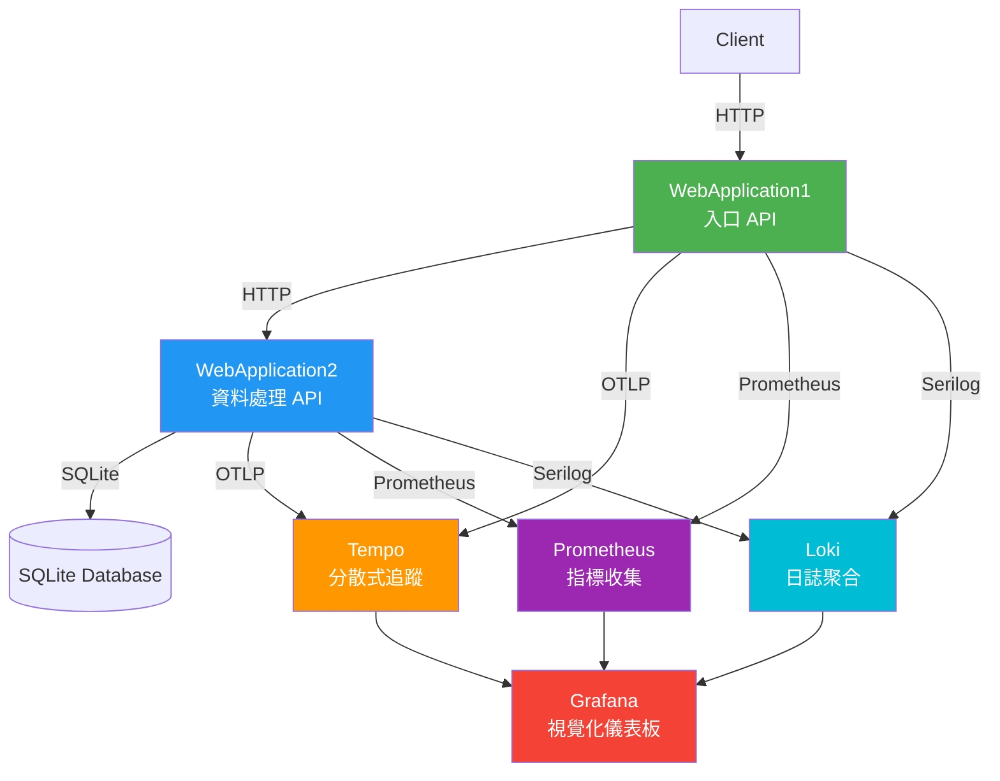

# OpenTelemetry 範例專案

這是一個完整的 OpenTelemetry 整合範例專案，展示如何在 .NET 應用程式中實作分散式追蹤（Distributed Tracing）、指標收集（Metrics）和日誌聚合（Logging）。

## 專案簡介

本專案包含兩個 ASP.NET Core Web API 應用程式，展示微服務架構下的可觀測性（Observability）實作：

- **WebApplication1**：入口 WebAPI，負責對外服務，透過 HttpClient 呼叫 WebApplication2
- **WebApplication2**：資料處理層，包含 Service 和 Repository，使用 SQLite 資料庫

## 系統架構



## 專案結構

```
OpenTelemetry.Sample/
├── Common/                 # 共享程式庫
│   ├── AOP/               # 面向切面程式設計
│   │   ├── Instrumentation.cs
│   │   ├── TracingAspect.cs
│   │   └── TracingAttribute.cs
│   ├── Observability/     # OpenTelemetry 整合
│   │   ├── LoggingSetup.cs
│   │   ├── MetricsSetup.cs
│   │   └── TracingSetup.cs
│   ├── Models/            # 資料模型
│   │   ├── Product.cs
│   │   ├── User.cs
│   │   └── UserProductDataModel.cs
│   └── Settings/          # 設定類別
│       └── ApiSettings.cs
├── WebApplication1/       # 入口 WebAPI
│   ├── Controllers/       # API 控制器
│   │   ├── LogController.cs
│   │   ├── ProductController.cs
│   │   ├── UserController.cs
│   │   └── WeatherForecastController.cs
│   ├── Infrastructure/    # 基礎設施
│   │   └── Helper/ApiHelper.cs
│   ├── Repository/        # 資料存取層
│   │   └── UserRepository.cs
│   ├── Dockerfile
│   ├── Program.cs
│   └── appsettings.json
├── WebApplication2/       # 資料處理 WebAPI
│   ├── Controllers/       # API 控制器
│   │   ├── ProductController.cs
│   │   ├── UserController.cs
│   │   └── WeatherForecastController.cs
│   ├── Service/          # 業務邏輯層
│   │   ├── Product/ProductService.cs
│   │   └── User/UserService.cs
│   ├── Repository/       # 資料存取層
│   │   ├── Product/ProductRepository.cs
│   │   ├── User/UserRepository.cs
│   │   └── DataContext.cs
│   ├── Migrations/       # 資料庫遷移
│   ├── Dockerfile
│   ├── Program.cs
│   └── appsettings.json
└── docker-compose-tempo/ # 監控堆疊 Docker Compose
    ├── docker-compose.yaml
    ├── tempo.yaml
    ├── prometheus.yaml
    └── grafana-datasources.yaml
```

## 技術棧

- **.NET 10.0** - 應用程式框架
- **ASP.NET Core Web API** - Web API 框架
- **Entity Framework Core** - ORM 框架
- **SQLite** - 輕量級資料庫
- **OpenTelemetry** - 可觀測性標準
  - Tracing（分散式追蹤）
  - Metrics（指標收集）
  - Logging（日誌記錄）
- **AspectInjector** - AOP 框架
- **Serilog** - 結構化日誌框架
- **Docker & Docker Compose** - 容器化部署

## 監控堆疊

本專案整合完整的可觀測性監控堆疊：

### Tempo (分散式追蹤)
- 收集和儲存分散式追蹤資料
- 支援 OTLP (OpenTelemetry Protocol)
- 提供強大的查詢功能

### Prometheus (指標收集)
- 收集和儲存時間序列指標
- 支援 Prometheus 查詢語言 (PromQL)
- 提供 Exemplar 支援，關聯追蹤資料

### Loki (日誌聚合)
- 高效的日誌聚合系統
- 支援標籤索引
- 與 Grafana 深度整合

### Grafana (視覺化)
- 統一的視覺化儀表板
- 支援多個資料來源
- 提供 TraceQL 查詢編輯器

## OpenTelemetry 整合說明

### Tracing (分散式追蹤)
- 使用 OTLP 協議匯出到 Tempo
- 自動追蹤 ASP.NET Core 請求
- 支援 HttpClient 和 Entity Framework Core 自動追蹤
- 使用 `[Tracing]` 屬性實現 AOP 方法追蹤

### Metrics (指標收集)
- 透過 Prometheus Exporter 匯出指標
- 收集 ASP.NET Core 內建指標
- 支援自訂指標
- 提供 `/metrics` 端點供 Prometheus 抓取

### Logging (日誌記錄)
- 整合 Serilog 結構化日誌
- 支援日誌豐富（Enrichment）
- 匯出到 Loki 進行集中管理
- 與追蹤資料關聯

### AOP (面向切面程式設計)
使用 AspectInjector 實現方法級別的自動追蹤：

```csharp
[Tracing]
public class UserService
{
    public async Task<User?> GetAsync(int userId, CancellationToken ct)
    {
        // 方法執行時會自動建立追蹤 Span
    }
}
```

## API 文件

### WebApplication1 (入口 API)

#### 使用者相關
- `GET /user/{userId}` - 取得使用者資訊
- `POST /user` - 建立使用者
  - Request Body: `{"name": "string", "email": "string", "password": "string"}`
- `GET /user/Product/{userId}` - 取得使用者與產品資訊

#### 產品相關
- `GET /product` - 取得產品列表
- `GET /product/{id}` - 取得單一產品
- `POST /product` - 建立產品
  - Request Body: `{"name": "string", "price": number, "userId": number}`

#### 其他
- `GET /weatherforecast` - 取得天氣預報（範例端點）

### WebApplication2 (資料處理 API)

#### 使用者相關
- `GET /user/{userId}` - 取得使用者資訊
- `POST /user` - 建立使用者
  - Request Body: `{"name": "string", "email": "string", "password": "string"}`
- `GET /user/Product/{userId}` - 取得使用者與產品資訊

#### 產品相關
- `GET /product` - 取得產品列表
- `GET /product/{id}` - 取得單一產品
- `POST /product` - 建立產品
  - Request Body: `{"name": "string", "price": number, "userId": number}`

#### 其他
- `GET /weatherforecast` - 取得天氣預報（範例端點）

## 部署說明

### 前置需求
- Docker
- .NET 10.0 SDK (僅開發時需要)

### 1. 建置 Docker 映像檔

```bash
# 建置 WebApplication1 映像檔
docker build -f ./WebApplication1/Dockerfile -t webapp1-release:latest --build-arg BUILD_CONFIGURATION=Release .

# 建置 WebApplication2 映像檔
docker build -f ./WebApplication2/Dockerfile -t webapp2-release:latest --build-arg BUILD_CONFIGURATION=Release .
```

### 2. 啟動監控堆疊

```bash
# 切換到 docker-compose-tempo 目錄
cd ../docker-compose-tempo

# 啟動所有監控服務
docker-compose up -d
```

### 3. 執行應用程式容器

#### 原生方式（獨立網路）
```bash
# 執行 WebApplication1
docker run -d --name webapp1-release --env ASPNETCORE_ENVIRONMENT=Release -p 5132:8080 webapp1-release:latest

# 執行 WebApplication2
docker run -d --name webapp2-release --env ASPNETCORE_ENVIRONMENT=Release -p 5133:8080 webapp2-release:latest
```

#### 使用監控網路（推薦）
```bash
# 執行 WebApplication1
docker run -d --name webapp1 -p 5132:8080 webapp1-release:latest --network monitoring

# 執行 WebApplication2
docker run -d --name webapp2 -p 5133:8080 webapp2-release:latest --network monitoring
```

### 4. 驗證部署

```bash
# 檢查容器狀態
docker ps

# 測試 API 端點
curl http://localhost:5132/weatherforecast
curl http://localhost:5133/weatherforecast
```

## 監控服務存取

部署完成後，可以透過以下 URL 存取監控服務：

| 服務 | URL | 預設帳號 |
|------|-----|----------|
| **Grafana** | http://localhost:3000 | admin / admin |
| **Prometheus** | http://localhost:9090 | - |
| **Tempo** | http://localhost:3200 | - |
| **Loki** | http://localhost:3100 | - |

### Grafana 設定說明

Grafana 的資料來源已透過 `grafana-datasources.yaml` 自動設定，包含：
- Tempo (分散式追蹤)
- Prometheus (指標)
- Loki (日誌)

如需查看容器內的設定檔：
- **VSCode**: 透過 Docker 擴充功能查看容器檔案系統
- **Rider**: Services > Podman > Container > 右鍵 > Show Files

## 重要設定說明

### 容器間通訊
- Docker 容器間通訊使用 `http://host.docker.internal:5132`
- 若使用 Podman，則改用 `http://host.containers.internal:5132`

### 建置設定
- Release 模式需要設定 `BUILD_CONFIGURATION=Release`
- 若使用 SlowCheetQ，必須使用 Release 組態

### OTLP 設定
- Tracing URL: `http://localhost:4317` (OTLP gRPC)
- Service Name: 在 `appsettings.json` 中設定

### 排除追蹤的路徑
以下路徑不會被追蹤：
- `/health`
- `/`
- `/metrics`

## 開發指南

### 本地開發

```bash
# 還原套件
dotnet restore

# 建置專案
dotnet build

# 執行 WebApplication1
cd WebApplication1
dotnet run

# 執行 WebApplication2（另一個終端機）
cd WebApplication2
dotnet run
```

### 資料庫遷移

```bash
# 在 WebApplication2 目錄下執行
dotnet ef migrations add MigrationName
dotnet ef database update
```

### 新增自訂追蹤

```csharp
// 使用 AOP 屬性
[Tracing]
public async Task<User?> GetUserAsync(int userId)
{
    // 方法會自動被追蹤
}

// 手動建立追蹤
using var activity = Instrumentation.StartActivity("CustomOperation");
activity?.SetTag("userId", userId);
// 執行操作
```

### 新增自訂指標

```csharp
// 在 MetricsSetup.cs 中定義 Meter
var meter = new Meter("MyService", "1.0.0");

// 建立計數器
var counter = meter.CreateCounter<int>("my_service_requests", "requests");

// 記錄指標
counter.Add(1, new KeyValuePair<string, object?>("operation", "getUser"));
```

## 故障排除

### 容器無法連線
- 確認容器是否在同一個網路中
- 檢查 `host.docker.internal` 是否可解析
- 查看容器日誌：`docker logs <container_name>`

### 追蹤資料未顯示
- 確認 Tempo 服務正在運行
- 檢查 OTLP 端點設定是否正確
- 查看應用程式日誌是否有錯誤

### 指標未收集
- 確認 Prometheus 可以存取 `/metrics` 端點
- 檢查 Prometheus 設定檔中的目標設定
- 驗證應用程式是否正確匯出指標

## 授權

本專案僅供學習和參考使用。

## 相關資源

- [OpenTelemetry .NET 文件](https://opentelemetry.io/docs/instrumentation/net/)
- [Tempo 文件](https://grafana.com/docs/tempo/latest/)
- [Prometheus 文件](https://prometheus.io/docs/)
- [Loki 文件](https://grafana.com/docs/loki/latest/)
- [Grafana 文件](https://grafana.com/docs/grafana/latest/)
