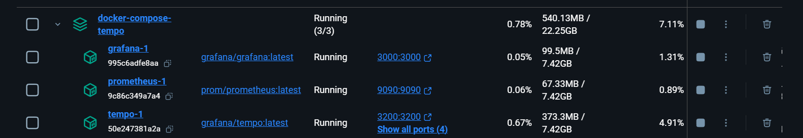
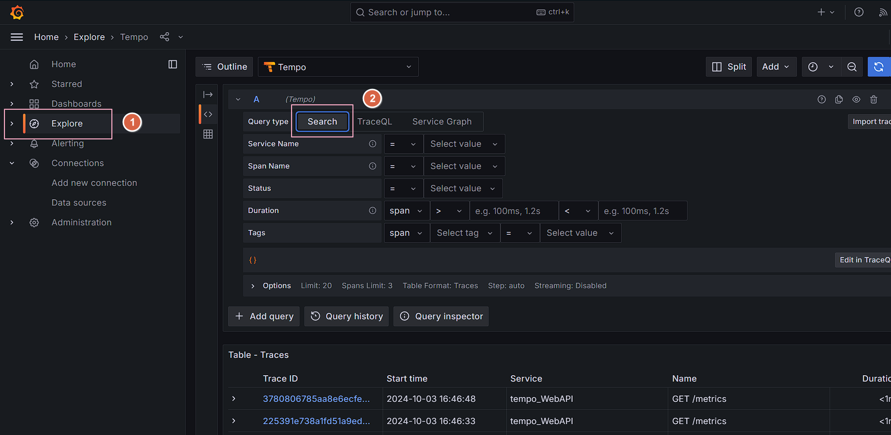
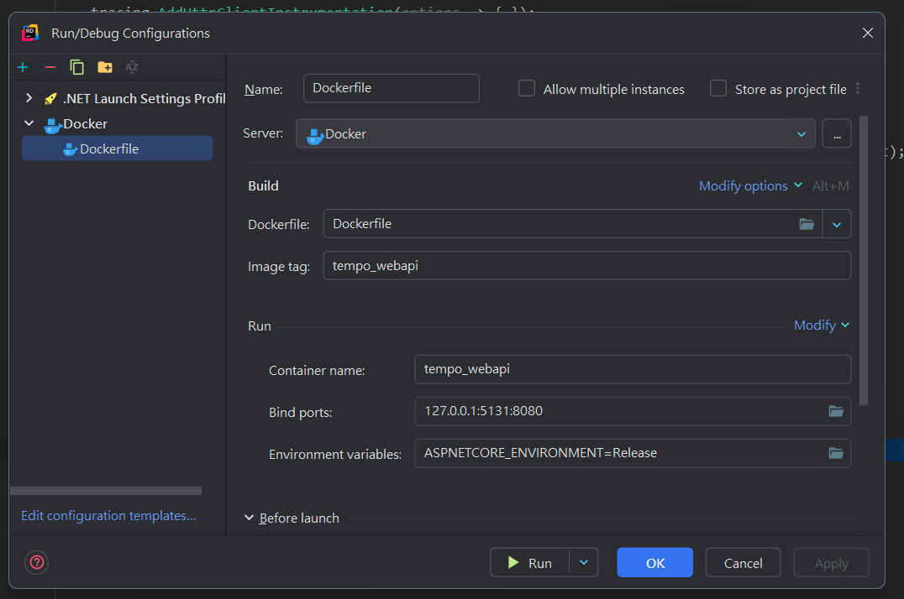

# PrometheusWebApi


## 參考文章

[使用 Docker Compose 啟動 Grafana Tempo - Yowko's Notes](https://blog.yowko.com/docker-compose-grafana-tempo/)

[將 ASP.NET 的 Trace 整合至 Grafana Tempo - Yowko's Notes](https://blog.yowko.com/aspdotnet-tempo/)

[Example: Use OpenTelemetry with Prometheus, Grafana, and Jaeger](https://learn.microsoft.com/en-us/dotnet/core/diagnostics/observability-prgrja-example)


代辦清單

- [ ] 加入Loki
  - [ ] [使用 Grafana 和 Loki 進行 .NET Core 微服務日誌記錄 |通過 Arkaprava Sinha | .Net 程式設計 |中等的 --- .NET Core Microservice Logging with Grafana and Loki | by Arkaprava Sinha | .Net Programming | Medium](https://medium.com/c-sharp-programming/net-core-microservice-logging-with-grafana-and-loki-92cd2783ed88)
  - [ ] [手把手教你 Grafana Loki︰從入門到精通. 現在時間下午五點十二分，總算把 Grafana Loki… | by Ivan Cheng | Medium](https://medium.com/@jieshiun/手把手教你-grafana-loki-從入門到精通-feab84c209f0)

## 開始實作

> 目標：建立一個 ASP.NET WEBAPI 產出 OpenTelemetry
> 1. 使用 Prometheus 作為監控(Metrics)
> 2. 使用 Grafana 作為監控視覺化
> 3. 使用 Tempo 作為分散式追蹤(Tracing)


1. 安裝環境

已經有範例 docker-compose-tempo/docker-compose-tempo.yaml 

唯一有調整的是  prometheus.yaml 

```yaml
global:
  scrape_interval:     15s
  evaluation_interval: 15s

scrape_configs:
  - job_name: 'prometheus'
    static_configs:
      - targets: [ 'localhost:9090' ]
  - job_name: 'tempo'
    static_configs:
      - targets: [ 'tempo:3200' ]
  #增加了一組，未來只要增加一個新的專案要觀察都要補上一個 job_name
  - job_name: 'tempo-webapi'
    static_configs:
      - targets: ['host.docker.internal:5131']

```

執行 docker-compose

```
cd Docker
docker-compose -f docker-compose-tempo.yaml up -d
```

2. 確認 Grafana 正常運作
```
http://localhost:3000/

帳密
admin
pass.123
```



---

### Grafana

#### Explore 

##### Tempo

用於 Tracing API 



#### Dashboard

Dashboard - 目前可以正常執行的範例

[Introducing ASP.NET Core metrics and Grafana dashboards in .NET 8 - .NET Blog (microsoft.com)](https://devblogs.microsoft.com/dotnet/introducing-aspnetcore-metrics-and-grafana-dashboards-in-dotnet-8/?hide_banner=true)

[aspire/src/Grafana/dashboards at main · dotnet/aspire (github.com)](https://github.com/dotnet/aspire/tree/main/src/Grafana/dashboards)

Dashboards > New > New dashboard > Import a dashboard > 把 Json 貼進去就可以了

> 這兩個當作備份，因為設定比較複雜 所以先不考慮
>
> [ASP.NET OTEL Metrics | Grafana Labs](https://grafana.com/grafana/dashboards/17706-asp-net-otel-metrics/)
>
> [OpenTelemetry dotnet webapi | Grafana Labs](https://grafana.com/grafana/dashboards/20568-opentelemetry-dotnet-webapi/)

---

### WebAPI

> 目前比較多資源還是 dotnet 8 所以這邊先以 8為範例，也有 Metrics 範例

#### 安裝套件

```csharp
<PackageReference Include="OpenTelemetry.Exporter.Console" Version="1.9.0" />
<PackageReference Include="OpenTelemetry.Exporter.OpenTelemetryProtocol" Version="1.9.0" />
<PackageReference Include="OpenTelemetry.Exporter.Prometheus.AspNetCore" Version="1.9.0-beta.2" />
<PackageReference Include="OpenTelemetry.Extensions.Hosting" Version="1.9.0" />
<PackageReference Include="OpenTelemetry.Instrumentation.AspNetCore" Version="1.9.0" />
<PackageReference Include="OpenTelemetry.Instrumentation.Http" Version="1.9.0" />
```

#### appsettings.json

```json
"OTLP_ENDPOINT_URL": "http://localhost:4317",
"OTEL_SERVICE_NAME": "tempo_webAPI"
```

#### appsettings.Release.json

```json
"OTLP_ENDPOINT_URL": "http://host.docker.internal:4317"
```

#### Program.cs

```csharp
//[Opentelemetry-基本設定]
var greeterMeter = new Meter("OtPrGrYa.Example", "1.0.0");
var countGreetings = greeterMeter.CreateCounter<int>("greetings.count", description: "Counts the number of greetings");
var greeterActivitySource = new ActivitySource("OtPrGrJa.Example");

//[Opentelemetry-基本設定]
var tracingOtlpEndpoint = builder.Configuration["OTLP_ENDPOINT_URL"];
Console.WriteLine($"OtlpEndpoint:[{tracingOtlpEndpoint}]");

var otel = builder.Services.AddOpenTelemetry();

// Configure OpenTelemetry Resources with the application name
otel.ConfigureResource(resource => resource
    .AddService(serviceName: builder.Environment.ApplicationName));

// Add Metrics for ASP.NET Core and our custom metrics and export to Prometheus
otel.WithMetrics(metrics => metrics
    // Metrics provider from OpenTelemetry
    .AddAspNetCoreInstrumentation()
    .AddHttpClientInstrumentation()
    .AddMeter(greeterMeter.Name)
    // Metrics provides by ASP.NET Core in .NET 8
    .AddMeter("Microsoft.AspNetCore.Hosting")
    .AddMeter("Microsoft.AspNetCore.Server.Kestrel")
    .AddPrometheusExporter()); // 匯出 metrics 到 Prometheus

// Add Tracing for ASP.NET Core and our custom ActivitySource and export to Jaeger
otel.WithTracing(tracing =>
{
    tracing.AddAspNetCoreInstrumentation(options =>
    {
        options.Filter = (httpContext) =>
        {
            //排除一些不需要觀察的路徑
            return !(httpContext.Request.Path == "/health" || 
                    httpContext.Request.Path == "/metrics");
        };
    });
    tracing.AddHttpClientInstrumentation(options => { });
    tracing.AddSource(greeterActivitySource.Name);

    if (tracingOtlpEndpoint != null)
    {
        //匯出 Tracing 資料到 Tempo
        tracing.AddOtlpExporter(otlpOptions => { otlpOptions.Endpoint = new Uri(tracingOtlpEndpoint); });
    }
    else
    {
        tracing.AddConsoleExporter();
    }
});

```

```csharp
//[Prometheus-基本設定]
app.MapPrometheusScrapingEndpoint();
```

---

#### 執行 Docker

1. 確認 Docker 執行後的 port 是對應到 `prometheus.yaml` 設定的 `targets: ['host.docker.internal:5131']` 
2. 為了讓內部



